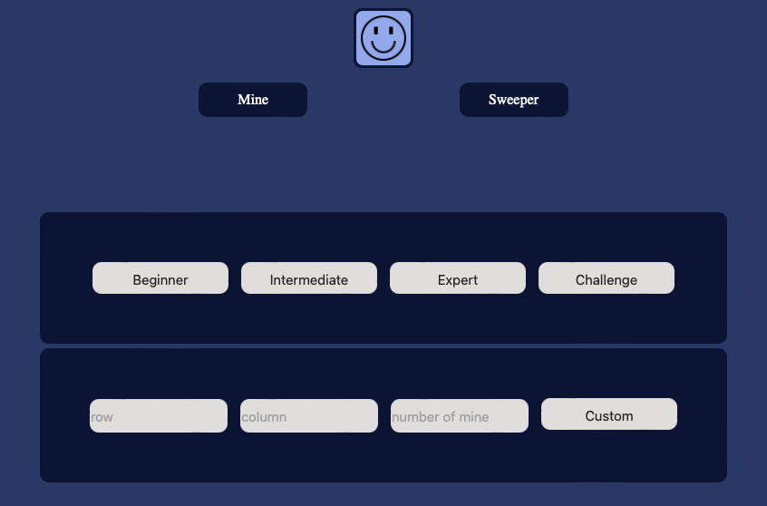
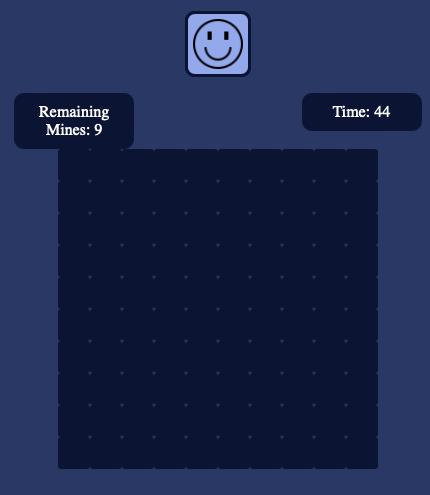
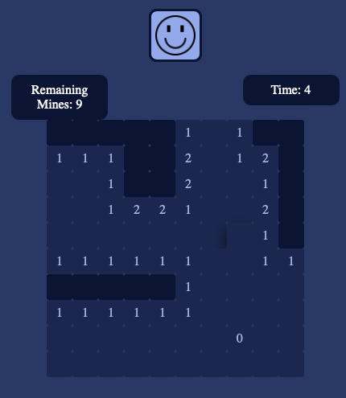
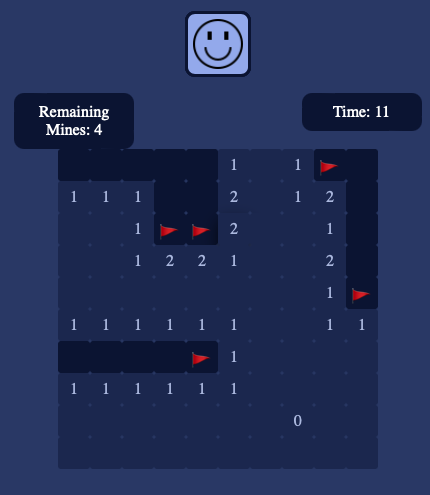
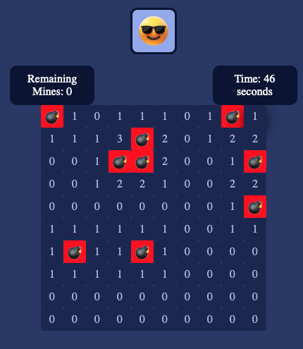
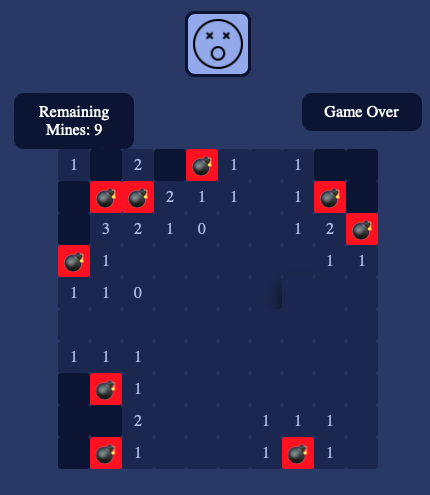

# Minesweeper

##### To win a round of Minesweeper, you must click on the board every square that doesn't have a mine under it.

* If you think there is a mine under the square, you may right-click.
* If you want to restart, you may click the emoji.
* If you want to reset the difficulty, you may refresh it.

[PLAY](https://henrychung98.github.io/mineSweeper/)

Choose your level

Your screen once you click beginner

Click the tiles and find mines

If you think there is a mine under the tile, right-click it.

When you succeed

When you failed

